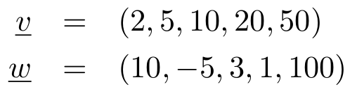
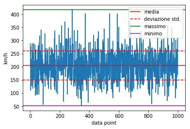
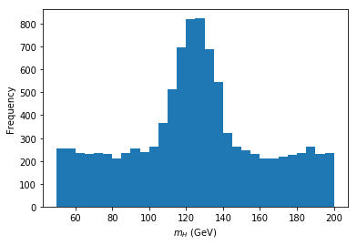

# Chapter 6

### Jesús Urtasun Elizari - Uiverisity of Milan - 2019/20

**Note:** Esercizi di base in C++: arrays.

**Note:** Base exercises in C++: for loop, while, do/while.

Before starting we suggest to create a folder for Lesson 4 where you can save all files that will be created for the exercise
```bash
cd ~/           # go the home directory
mkdir Chapter03  # create the directory Chapter03 in home
cd lezione3     # go inside Chapter03
```
Create a `makefile` to compile all exercises

## Exercise 1 - Hello World arrays

Write a C++ program where arrays are used.

1. Build next vector of type double using stack arrays:


2. Print on the terminal the value of `v` and `w`, following the next format:
```
  v[0] = <value>
  v[1] = <value>
  ...
  w[0] = <value>
  w[1] = <value>
  ...
```

3. Create an array `double s[5]` and initialize `s` with the values of `v`.

4. Sum the values of `w` to `s`.

5. Print `s` on screen, following the format of used on 2.

## Exercsie 2 - Scalar product

Write a C++ program that computes the scalar product using dynamic arrays.

1. Build the precedent vectors `v` and `w` using dynamic arrays. Remember to allocate them using the operator `new` and delete them with `delete`.

2. Implement the scalar product between `v` and `w` and print the result.

3. Create a vector `z` equal to `v` (same dimension and copy of the content) with `z[2] = 0`.

4. Compute the normalization of `z`.

5. Normalize `z` and print its values on the terminal.

## Exercise 3 - Matrix-vector product

Write a C++ program that compute a matrix-vector product.


1. Create stack arrays for all objects, i.e. `x`, `M`, `v`, write the matrices that that compose `M` in two different arrays `A` e `B`.

2. Compute `M` applying the matrix product between `A` and `B`.

3. Compute the product `M * x`.

3. Print the result and verify the solution `r = {34, 39, 7}`.

## Exercise 4 - Rectilinear movement

Write a C++ program that reads space and time coordinates of a falling particle from a file, computes the instant velocity for each measurement and the mean velocity, its standard deviation, the minimum and maximum values

1. Download the data with:
```bash
wget https://raw.githubusercontent.com/JesusUrtasun/CppCourse/master/Chapter06/data_moto.dat
```

2. Read from the file the `N = 1000` (number of elements) points **(x y)** with the space (km) and times (h), and compute for each element the instant velocity. Save those values in an array of type `double`.

3. Compute the mean velocity, the standard deviation and print the results on screen.

4. Compute the minimum and maximum velocity, and print the results on screen.

5. Verify the results with the next plot:




## Exercise 5 - Estimate the mass of the Higgs boson

Write a C++ program that reads from a file the distribution of invariant mass for the production channel of 4 leptons to Higgs, measured at the ATLAS detector, and determine the most frequent (most likely) value for the mass.

La distribuzione in questione si presenta graficamente nel modo seguente:



1. Download data with:
```bash
wget https://raw.githubusercontent.com/JesusUrtasun/CppCourse/master/Chapter06/data_higgs.dat
```

2. Read all `N = 10000` values of invariant mass and save the data in an array `mass`.

3. Order the vector `mass` in increasing way using sort selection. (Control the algorithm printing on the values on screen)

4. Extract the minimum and maximum values directly from `mass` (without loops or extra algorithms). Print the values on terminal.

5. Build an array `bins` that contains upper and lower edge of an histogram that begins with the mimimum value of the mas and increases in steps of 5 GeV. Hiny: determine the number of bins needed and create a dynamic array for the binning.

6. Build an array `freq` for the frequences of the histogram.

7. Fill the histogram and print the values of the bins and frequence on screen.

8. Determine the bin (lower-edge) of Higgs mass with highest frequence.
