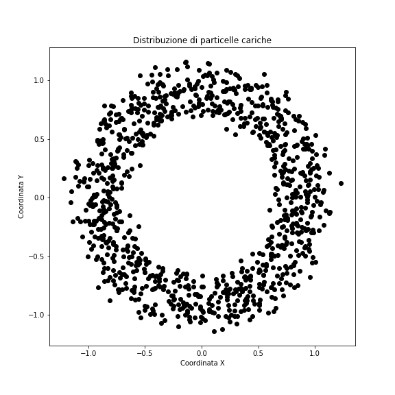

# Chapter 8

### Jesús Urtasun Elizari - University of Milan - 2019/20

**Subject:** Base exercises in C++: data structure and first steps with ROOT.

Before starting we suggest to create a folder for Lesson 4 where you can save all files that will be created for the exercise
```bash
cd ~/           # go the home directory
mkdir Chapter08  # create the directory Chapter08 in home
cd Chapter08     # go inside Chapter08
```
Create a `makefile` to compile all exercises

## Exercise 1 - Hello World struct

Write a C++ program where complex numbers are saved as data structure

1. Create a data structure called `complex`. Inside this `struct` implement two members of type `double`,
`real` for the real part, and `imag` for the imaginary one.

2. Write a the function `main` and declare 2 variables of type `complex` called `a` and `b` respectively.

3. Assign to `a` the complex number `7 + 2i`.

4. Assign to `b` the value of `a`.

5. Implement a function tha takes a `complex` and prints on terminal the real and imaginary part separated by a coma.

6. Use the function above for printing the content of `a` and `b`.

7. Implement a function `module` of type `double` that computes the module of a `complex`.
Test the function directly on the main passing `a` as argument.

8. Implement a function `sum` of type `complex` thakes as arguments 2 objects `complex` and returns a new `complex`
where the real and imaginary parts correspond to those of the sum of the arguments.

## Exercise 3 - Headers and source

Write a C++ program that uses a header file.

1. Create a header file named `functions.h` and declare a function `change1` of type `void` that takes as arguments
the referiments to two numbers of type `double`.

2. On the same header, declare a function called `change2` of type `void` that takes the pointers of two numbers of type `double`.

3. Create a file `functions.cc` and implement and algorithm that changes variables of type double `double` for the functions `change1` and `change2`.

4. Create a file `main.cc`, include the header `functions.h` and test the functions `change1` and `change2`.

5. Add to the `makefile` the rules for compiling all tiles `*.cc`.

## Exercise 3 - Hello world ROOT

First steps with ROOT in interactive mode.

*Base commands*

1. Open a terminal and launch ROOt with the command `root`.

2. Try to write C++ code in interactive mode:
  - `5+2`
  - `double a = 5, b=-2; cout << a + b << endl;`
  - try other C++ instructions.

3. Exit ROOT with the command `.q`.

*Graph functionality*

1. Launch ROOT from terminal.

2. Try to design a function of one variables with ROOT. Write the following code:
```c++
TF1 f("f", "sin(x)/x", -5, 5);
f.Draw();
```

3. On the graph window check View -> Editor, try to:
  - change the color of the function.
  - add the title `x` on the x axis.
  - save the plot in PDF format.

4. Close the window and exit ROOT with the command `.q`.

## Exercise 4 - Macro ROOT 1

Write a ROOT macro that generates and prints random numbers between [0,100].

1. Create a ROOT file called `exercise4.C`.

2. Implement a loop of `1000` calls to the function `rand() % 100` to generate integers between [0,100]. Save all numbers in an array.

3. Compute the mean value of the array.

4. Try to run the macro with:
  - `root exercise4.C`
  - `root` followed by `.x exercise4.C`.

## Exercise 5 - Macro ROOT 2

Write a ROOT macro with functions.

1. Create a ROOT macro `exercise5.C`.

2. Implement the code of the previous exercise in this macro, replacing the function `int main()` with `void exercise5()` and adding its`return`.
Modify also the name of the `struct complex` in `struct mycomplex` to avoid conflicts with the class `std::complex` loaded automatically from ROOT6.

3. Run the macro with:
  - `root exercise5.C`
  - `root` followed by `.x exercise5.C`
  - `root` followed by `.L esercizio5.C` and the call to `esercizio5()`

4. Check that the results are the same as in exercise 1.

## Exercise 6 - Macro ROOT 3

Write a ROOT marco with `struct` arrays. Read from file the cartesian coordinates of a falling particles in a magnetic field
with source in `(0,0)` as the next picture shows:


1. Create a ROOT macro `exercise6.C`.

2. Define a `struct point2d` where you save a pointer `coordinate` and a variable `distance` pf type `double`.

3. Download the file that contains the coordinate `(x,y)` for each particle with `wget`:
```
wget https://raw.githubusercontent.com/JesúsUrtasun/CppCourse/master/Chapter08/data.dat
```

4. Create a function `exercise6` of type `void` and an array of structutres `point2d` called `points` of dumension 1000, implement a loop that for all element in `point2d` initializes the pointer `coordinate` as a dynamic array of dimensione 2, where the first value is `x` and the second `y` of the file.

5. Write a function `compute_distance` of type `void` that takes as argument 1 `point2d` and computes the distance with respect to the source using Pythagoras theorem .

6. Compute the mean `distance` for all elements of the `points` array using a function `mean` of type `double` that takes as argument the array `points` and its dimensions.

7. Clean the memory and run the macro with ROOT.
