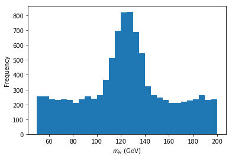

## Chapter 6 - Algebra, armadillo, real RCDS problems

- Real algebra: scalar product, matrix-vector product
- Armadillo library
- Real RCDS problems: Rectilinear movement, estimate Higgs mass, umerical integration.

Before starting we suggest to create a folder for Chapter  6 where you can save all files that will be created for the exercise
```bash
cd ~/           # Go the home directory
mkdir Chapter6  # Create the directory Chapter6
cd Chapter6     # Go inside Chapter6
```
Create a `makefile` with targets:
- `all`: compile all programs in this folder.
- `clean`: delete all programs created by `all`.

Example of `makefile`:

```makefile
all: program1

program1: exercise1.cc
  g++ exercise1.cc -o program1
  # also: g++ $< -o $@

clean:
  rm program1
```

in this way all programs will be compiled using the following command in the terminal:
```bash
$ make
```
while all programs will be eliminated by using the folloing one:
```bash
$ make clean
```

### Exercsie 1 - Matrix manipulation

Write a C++ program that computes the scalar product using dynamic arrays.

1. Build the precedent vectors `v` and `w` using dynamic arrays. Remember to allocate them using the operator `new` and delete them with `delete`.

2. Create an array `s` as the sum of `v` and `w`.

3. Print the elemnts of `s`.

### Exercsie 2 - Scalar product

Write a C++ program that computes the scalar product using dynamic arrays.

1. Build the precedent vectors `v` and `w` using dynamic arrays. Remember to allocate them using the operator `new` and delete them with `delete`.

2. Implement the scalar product between `v` and `w` and print the result.

3. Create a vector `z` equal to `v` (same dimension and copy of the content) with `z[2] = 0`.

4. Compute the normalization of `z`.

5. Normalize `z` and print its values on the terminal.

### Exercise 3 - Matrix-vector product

Write a C++ program that compute a matrix-vector product.

1. Create stack arrays for all objects, i.e. `x`, `M`, `v`, write the matrices that that compose `M` in two different arrays `A` e `B`.

2. Compute `M` applying the matrix product between `A` and `B`.

3. Compute the product `M * x`.

3. Print the result and verify the solution `r = {34, 39, 7}`.

### Exercise 4 - Scalar product, norm, transposed matrix

Write a C++ program that computes the following algebra operations.

1. Create a 2 1D arrays of type `double` with `v = {1, 2, 3, 4, 5}, w = {10, 2, 4, 3, 2}`. 
Create a 2D array of type `double` with `M = {{1, 2, 3}, {4, 5, 6}, {7, 8, 9}}`.

2. Implement a function `scalar` of type `double` that computes the scalar product between 2 arrays.
Test the function with `v` and `w` and print the result on screen.

3. Implement a function `norm` of type `double` that computes the norm of an array using the function `scalar`. Test the implementation of`v` and print the result on screen.

4. Implement a function `change` of type `void` that changes the values between 2 objects by reference.
Apply this function to `M` (e.g. compute the transpose) and print the result on screen.


### Exercise 5 - Data structure and complex numbers

Write a C++ program where complex numbers are saved as data structure

1. Create a data structure called `complex`. Inside this `struct` implement two members of type `double`,
`real` for the real part, and `imag` for the imaginary one.

2. Write a the function `main` and declare 2 variables of type `complex` called `a` and `b` respectively.

3. Assign to `a` the complex number `7 + 2i`.

4. Assign to `b` the value of `a`.

5. Implement a function tha takes a `complex` and prints on terminal the real and imaginary part separated by a coma.

6. Use the function above for printing the content of `a` and `b`.

7. Implement a function `module` of type `double` that computes the module of a `complex`.
Test the function directly on the main passing `a` as argument.

8. Implement a function `sum` of type `complex` thakes as arguments 2 objects `complex` and returns a new `complex`
where the real and imaginary parts correspond to those of the sum of the arguments.

### Exercise 6 - Second order equations

Write a program in C++ that solves a second order equation `a x^2 + b x + c = 0`
for all discriminants (>, < e = 0) and where the variables `a`, `b` e `c` come assigned with `cin`.

1. Ask the user to introduce 3 numbers of type `double` representing the coefficients.

2. Compute the discriminant `D = b^2 - 4ac` using the function `std::pow`.

3. Create a condition `if/else` corresponding to the 3 possible cases of the discriminant.

4. Compute the solutions `x1` and `x2` using the quadratic formula for second order equations.
Note that for `D < 0`, the function `std::sqrt()` operates in the real numbers, therefore its argument must be a positive number.
Also in this case we will separe the computations of the real and imaginary part.

Verify the implementation for the following coefficients:
- `a = 2`, `b = 5`, `c = 2` -> solution `x1 = -0.5` e `x2 = -2`.
- `a = 4`, `b = -4`, `c = 1` -> solutions`x1,2 = 0.5`.
- `a = 1`, `b = 4`, `c = 5` -> solutions `x1 = -2 + i` e `x2 = -2 - i`.

### Armadillo, c++ library for vectors and matrices

[Armadillo](http://arma.sourceforge.net/) is a linear algebra library for C++ which uses syntax quite similar to that used in Matlab or Python (with NumPy). Setup is different for different operating systems but the instructions are pretty good.

Here we are going to just include the library directly by downloading and linking to the library files. This doesn't take advantage of your computer's inbuilt fast linear algebra libraries, but it is enough for our purposes.

Installation

* Download the Armadillo zip file from this GitHub repository.
* Extract it to the folder `armadillo-9.870.2` in your `cpp` folder.

Join in:

* New file: `armadillo_test.cpp`:

```c++
#include <iostream>
#include <armadillo>

using namespace std;
using namespace arma;

int main()
{
    arma_rng::set_seed_random();
    mat A = randu<mat>(4,5);
    mat B = randu<mat>(4,5);

    cout << A*B.t() << endl;

    return 0;
}
```

Compile:
* (On your own Mac/Linux machine) `c++ armadillo_test.cpp -o armadillo_test -I path_to_armadillo_include -llapack -lblas`
* (On college machines or your own Windows machine) `g++ armadillo_test.cpp -o armadillo_test -I path_to_armadillo_include -llapack -lblas -static-libstdc++`

* New file: `armadillo_equations.cpp`:

Let's solve the system of equations
* *x* + 5*z* = –1
* 2*x* + *y* + 6z = 0
* 3*x* + 4*y* = 1

```c++
#include <iostream>
#include <armadillo>

using namespace std;
using namespace arma;

int main()
{
    mat A = mat("1 0 5; 2 1 6; 3 4 0");
    mat b = mat("-1; 0; 1");
    mat x;

    x = solve(A,b);

    cout << x << endl;

    return 0;
}
```

Compile:
* (On your own machine) `c++ armadillo_equations.cpp -o armadillo_equations -Ipath_to_armadillo_include -llapack -lblas`
* (On college machines or your own Windows machine) `g++ armadillo_equations.cpp -o armadillo_equations -I path_to_armadillo_include -llapack -lblas -static-libstdc++`

We should get the solution: *x* = 19, *y* = –14, *z* = –4.

### Advanced - Rectilinear movement

Write a C++ program that reads space and time coordinates of a falling particle from a file, computes the instant velocity for each measurement and the mean velocity, its standard deviation, the minimum and maximum values

1. Download the data with:
```bash
wget https://github.com/ImperialCollegeLondon/RCDS-intro-cpp/blob/main/Chapter6/data_moto.dat
```

2. Read from the file the `N = 1000` (number of elements) points **(x y)** with the space (km) and times (h), and compute for each element the instant velocity. Save those values in an array of type `double`.

3. Compute the mean velocity, the standard deviation and print the results on screen.

4. Compute the minimum and maximum velocity, and print the results on screen.

5. Verify the results.

### Advanced - Estimate the mass of the Higgs boson

Write a C++ program that reads from a file the distribution of invariant mass for the production channel of 4 leptons to Higgs, measured at the ATLAS detector, and determine the most frequent (most likely) value for the mass.

La distribuzione in questione si presenta graficamente nel modo seguente:



1. Download data with:
```bash
wget https://github.com/ImperialCollegeLondon/RCDS-intro-cpp/blob/main/Chapter6/data_higgs.dat
```

2. Read all `N = 10000` values of invariant mass and save the data in an array `mass`.

3. Order the vector `mass` in increasing way using sort selection. (Control the algorithm printing on the values on screen)

4. Extract the minimum and maximum values directly from `mass` (without loops or extra algorithms). Print the values on terminal.

5. Build an array `bins` that contains upper and lower edge of an histogram that begins with the mimimum value of the mas and increases in steps of 5 GeV. Hiny: determine the number of bins needed and create a dynamic array for the binning.

6. Build an array `freq` for the frequences of the histogram.

7. Fill the histogram and print the values of the bins and frequence on screen.

8. Determine the bin (lower-edge) of Higgs mass with highest frequence.

### Advanced - Numerical integration

Write a C++ program that computes the numerical integral of an analytical function usin the trapezoidal rule
```
 /b
 |  f(x) dx =  d * Sum_{i=0,n-1} ( f(a + i * d) + f(a + (i + 1) * d) ) / 2
 /a
```
where `d = (b-a)/n`.

1. Implement a function `gauss` of type `double` that replaces tha value of a normalized Gaussian centered in `mu = 0` and  `sigma = 1`:
```
gauss(x) = 1/(sqrt(2*pi)) * exp(-x*x/2)
```

2. Implement a function `integrate_gaussian` of type `double` that takes arguments `a`, `b` and `n` (steps),
and computes the integral of `gauss` between `a` and `b`.

3. Test the function for `(a,b) = (-10, 10)` and `(a,b) = (-1,1)`, for each configuration change `n = [10,100]`.
